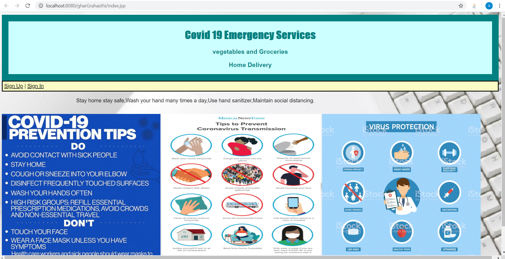
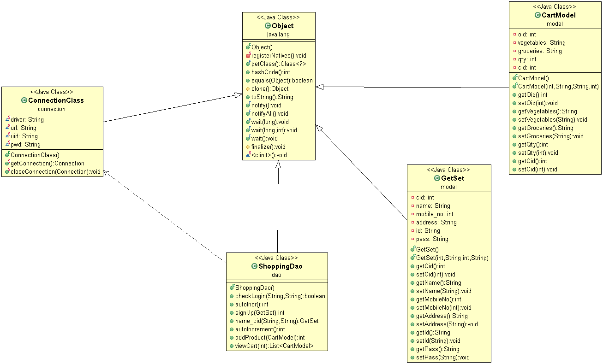

Objective: An online shopping site provides the vegetables and Groceries items and also help customers purchase them online without having to visit the shop physically.
How it works:-
•	User fill all the details and create his account.
•	Now login with email id and password.
•	After login a home page will appear with a list of vegetables and groceries packages with their price and pack code.
•	User can add product by click on add product option and fill all the details required(pack code and quantity) and click on add button.
•	Now product is added to the the cart user can see cart by click on view cart button.
Techonology used:-
HTML,JSP,CSS,Java,MySql,Tomcat server.

Architecture:-
It follow MVC architecture embedded with DAO(Data Access Object).

Advantages:-
As we all know Corona virus is spreading rapidly therefore we should not go outside so user can order vegetables and Groceries packages online by using our site without going outside.

How it looks:-

Class Diagram:-
 

